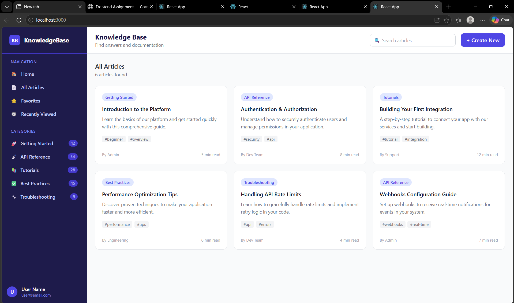
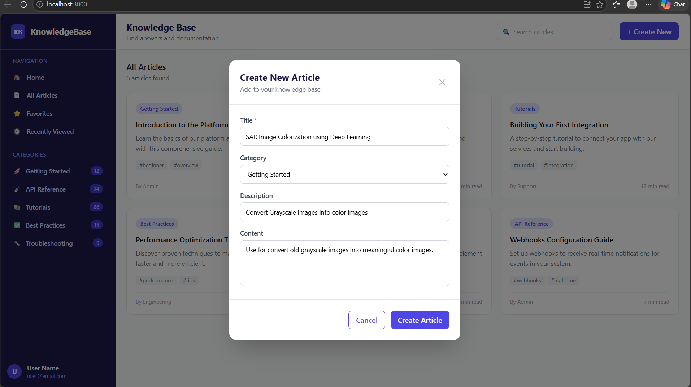

# 📚 Knowledge Base UI

A modern, responsive React application that replicates a Figma-based Knowledge Base platform with clean UI, reusable components, and interactive features.

---

## 🚀 Live Features

✨ Sidebar navigation with category filtering  
✨ Article cards with tags, author, and read time  
✨ Modal popup using **Create New** button  
✨ Live search filtering  
✨ Responsive grid layout (3-column design)  
✨ Clean UI based on Figma design  

---

## 🖼️ Screenshots

### 🔹 Home Page


### 🔹 Create Article Modal


### 🔹 Article Added View


---

## 🛠 Tech Stack

- ⚛️ React 18 (Hooks + Functional Components)
- 🎨 Tailwind CSS
- 🧩 Component-Based Architecture

---

## 📂 Project Structure

```
src/
├── components/
│   ├── layout/
│   │   ├── Sidebar.jsx
│   │   └── Header.jsx
│   └── ui/
│       ├── ArticleCard.jsx
│       ├── Modal.jsx
│       └── Button.jsx
├── data/
│   └── mockData.js
└── App.jsx
```

---

## ⚙️ Installation & Setup

```bash
git clone https://github.com/YOUR-USERNAME/knowledge-base-ui.git
cd knowledge-base-ui
npm install
npm start
```

🌐 Open: http://localhost:3000

---

## 💡 Key Highlights

- Reusable component design  
- Clean folder structure  
- Scalable architecture  
- Beginner-friendly implementation  
- Matches Figma UI with high accuracy  

---

## 🎯 Learning Outcomes

- React component structuring  
- State management using hooks  
- UI design implementation  
- Modal handling  
- Responsive layouts  

---

## 👩‍💻 Author

**Dipali Mali**  
🔗 https://github.com/dipalimali213
